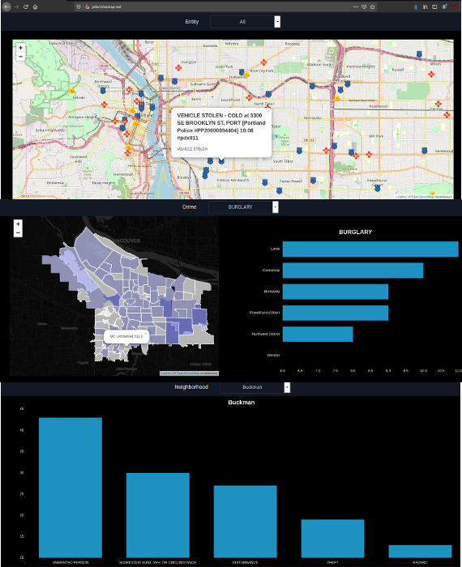

PDX Crime Map was migrated to [A new host](https://pdx-crime-maps.herokuapp.com/)

# pdx-crime-maps
A website that visualizes live and archived crime in Portland, Or. Data Collection started around Feburary 29th, 2020.

disclaimer: This project is not an official project sanctioned by any organization. The accuracy of the data and/or incidents is not verified by anyone.

# Motivation
The motivation for this project was to build a web site that was able to capture, store and present data while continuous updating the data base.

# Components

Data Collection is done by a twitter steam-listener. Each tweet is parsed and the data os pushed to an sql cloud data base.

Node.js/Express server is used on the back end which querries the could sql DB.

React is used on the front end which requests data from the back end.

Nginx is used as middleware

# Live Stie
[See it live](http://pdxcrimemap.net)

